# 基础使用说明
本小节主要针对框架中一些相对细小和基础的知识点进行说明，阅读完本小节之后能够帮助你更好的理解之后的章节内容。

## 安装
你可以通过pip包管理工具键入“框架名称” 或者 “框架.whl文件的绝对路径(存放在仓库的dist文件夹下)”完成框架的安装，详情如下:

* [正式版] `pip install kdtest==1.1.6`
* [测试版] `pip install -i https://test.pypi.org/simple/ kdtest==1.1.6`
* `pip install  C:/xxxxxx/kdtest-1.1.6-py3-none-any.whl`

你可以在控制台中键入 `kdtest -v` 来验证是否安装成功。
> 1.1.6为当前框架最新版本；推荐安装正式版

## 运行
你可以在系统自带的“cmd命令提示符”或者各编译器“PyCharm、Visual Studio Code”中的控制台键入 命令(框架命令)来运行框架，详情如下：

* `kdtest`
* `kdtest --startup`
* `kdtest --startup startup`

> 三条命令功能和处理逻辑均一致，`kdtest` 和 `kdtest --startup` 为“命令参数缺省”状态

## 框架命令可选参数
| 命令字句| 解释说明 | 参数 |  示例语句 |
| :-: | :-: | :-: | :- |
| --version [-v] | 当前安装的框架版本号 | None | kdtest --version |
| --help [-h] | 框架命令字句提示帮助 | None | kdtest --help |
| --new [-n] | 框架用例数据包生成 | None | kdtest --new |
| --change [-c] | 框架自定义配置文件生成 | None | kdtest --change |
| --parameter [-p] | 框架静态参数配置文件生成 | None | kdtest --parameter |
| --st | 框架初始化清除脚本生成 | None | kdtest --st |
| --unit_new | 框架自定义插件包模板生成 | None | kdtest --unit_new |
| --unit_show | 显示框架中目前安装的插件 | None | kdtest --unit_show |
| --unit_install | 框架自定义插件包安装 | 插件包绝对路径 | kdtest --unit_install C:\xx --unit_install C:\xx |
| --unit_uninstall | 框架自定义插件包卸载 | 插件包名称 | kdtest --unit_uninstall xxx --unit_uninstall xxx |
| --log | 测试报告名称指定 | 测试报告名称 | kdtest --log  xxxx |
| --startup | 框架启动 | startup | kdtest --startup  //  kdtest --startup startup |

> 注：[-x]代表该命令字句可支持简写

> 注意：`--log  [名称]` 命令仅支持在 `1.1.3` 及以上版本的框架中使用；键入`kdtest --log 第一轮集成测试`命令，在用例执行结束后会将生成的测试报告名称更改为 “第一轮集成测试”。

# 框架使用前须知
## 必要准备
* 1、在使用框架前你需要找到一个无权限限制的系统目录来作为你的工作目录(是否为空均可)，原因则是框架在执行过程中需要进行大量的文件夹和文件操作，所以需要你尽可能避免使用一些敏感目录来作为工作目录。
* 2、在你的工作目录中应该存在一个名为 `casesAggregate` 的文件夹(称为“用例数据包”，该文件夹名称可按照个人喜好自定义)，用来存放你的用例文件以及一些和用例相关的数据文件。你可以通过框架命令`kdtest -n` 或者 `kdtest --new` 让框架在你的工作目录中自动创建。
* 3、保证你的工作目录中存在框架的“参数配置文件”`parameters.json`(该文件名称可按照个人喜好自定义)，你可以通过框架命令`kdtest -p` 或者 `kdtest --parameter` 让框架在你的工作目录中自动创建。另外你需要文件中的提示完成参数配置。
## 注意事项
- 你的工作目录并不需要唯一；你在何处运行框架框架就会视此处为你的工作目录，当然你甚至可以在一个工作目录中嵌套创建一个工作目录，这并不会影响框架。

- 在“用例数据包”中，框架认定以 `interface_` 开头的文件夹为“接口数据文件夹”(该文件夹名称可按照个人喜好自定义)，以 `element_` 开头的文件夹为“元素节点数据文件夹”(该文件夹名称可按照个人喜好自定义)，分别用来存放你的需要配合用例一起执行的“接口数据”和“元素节点数据”。需要注意的是这两个文件夹并不是必须存在的你需要哪一项就创建那一项，如果都不需要则可以都不创建。框架之所以规定它们是为了能够更好的找到与用例对应的数据文件，仅此而已。

- 框架在运行过程中会自动在你的工作目录中生成几个文件夹，分别为“ `download` (可按照个人喜好自定义)存放被测系统中下载或者导出的文件”、“ `result\report` (可按照个人喜好自定义)存放测试结果报告.html”、“ `result\log ` (可按照个人喜好自定义)存放框架运行日志”。

- 如果你想要在你的测试用例开始执行前或者结束执行后做些事情，可以通过键入 `-> kdtest --st` 命令来让框架为你创建一个“初始化清除脚本 `__st__.py` (名称可按照个人喜好自定义)”，你只需要按照文件中的提示和引导对其进行编写。
	```
	# __st__.py
	
	# from kdtest import GSTORE, INFO
	
	def suite_setup():
	    # 初始化
	
	def suite_teardown():
	    # 清除
	```

- 可自定义的文件、文件夹名称修改方法代码展示
	> 可自定义的文件、文件夹名称修改方法：在框架的安装目录中(通常为pyton解释器安装目录中的 `\Lib\site-packages\kdtest` 文件夹)找到common.py文件，文件中带有 “通用名称”标注的变量值均可以修改，你只需要找到要修改的文件或文件夹名称对应的变量即可。

	```python
	# common.py

	CASES = "casesAggregate"  # 用例数据包
	INTER = "interface_"  # 接口数据文件夹名称格式限定
	ELE = "element_"  # 元素节点数据文件夹名称格式限定
	RE = "result\\report"  # excel测试结果目录结构
	RL = "result\\log"  # 运行日志测试结果目录结构
	DOWN = "download"  # 指定下载文件夹名称
	PIUG = "plugins"  # 自定义插件默认包文件夹名称
	P = "CJ_1"  # 自定义插件默认文件夹名称
	P_E = "elementData"  # 自定义插件默认数据文件夹名称
	P_U = "utils"  # 自定义插件默认工具文件夹名称
	P_INI = "my"  # 自定义插件默认配置文件名称
	P_M = "module"  # 自定义插件默认文件名称
	P_EY = "elementData"  # 自定义插件默认数据文件名称
	CHANGE = "change"  # 框架自定义配置文件名称
	PARA = "parameters"  # 框架静态启动参数配置文件名称
	ST = "__st__"  # 框架初始化清除脚本文件名称
	```
	
> 注意：download、result\report、result\log 这三个文件夹在你的工作目录中不是必须存在的，在不需要的时候你可以直接把它们删除，框架会在重新生成。

> 注意：`parameters.json` 和 `__st__.py` 两个文件中预先写好的“key键名” 和 “函数名”，不可随意更改。

## 用例数据包解释
用例数据包的名称必须为固定，框架默认为 `casesAggregate`，该名称你可以根据个人喜好自定义；若实际的文件夹名称与指定的文件夹名称不一致，则框架视其为不存在。
### 1. 子文件夹
- 在“用例数据包”中以 `element_`(可自定义) 开头的文件夹被框架视为“用例元素节点文件夹”，用于存放测试用例所依赖的元素节点数据。
- 在“用例数据包”中以 `interface_`(可自定义) 开头的文件夹被框架视为“用例接口数据文件夹”，用于存放测试用例所依赖的接口数据。

> 注：限定规则可根据个人喜好自行修改(修改方法，见“入门指南 - 框架使用前须知 - 注意事项 - 可自定义的文件、文件夹名称修改方法代码展示”)，且以上两个文件夹均不是必须存在的。
### 2. 子文件
- 用例步骤文件： 框架将存放在 “用例数据包” 中的所有Excel工作簿视为合法有效的用例步骤文件(不包含存放在“用例元素节点文件夹”和“用例接口数据文件夹”中的文件)；主要用于书写框架可操作的“测试用例”，一个Excel工作簿文件代表一组测试用例，工作簿中的单个Sheet表代表一条测试用例，每个工作表中的一个单元行代表一个用例步骤。

- 接口数据文件：框架将存放在 “用例接口数据文件夹”中的以InterfaceData命名的.yaml文件视为合法有效的接口数据文件。

- 元素节点数据文件：框架将存放在 “用例元素节点文件夹”中的以elementData命名的.yaml文件视为合法有效的元素节点数据文件。

> 注意：`InterfaceData.yaml` 和 `elementData.yaml` 文件名不可随意修改，否则框架将视其为不存在。

> 以上介绍的三种文件的详细书写规则请参考 “数据文件 - 用例步骤文件书写声明、接口数据文件书写声明、元素节点文件书写声明”。

> 注意：在存放指定用例所依赖的`InterfaceData.yaml` 和 `elementData.yaml` 文件时，需要原样复刻“用例步骤文件”的目录结构，原因则是框架会根据“用例步骤文件”的目录结构追踪与之匹配的`InterfaceData.yaml` 和 `elementData.yaml` 文件。
> - 用例步骤文件存放目录为: casesAggregate\2022_v11THEME\personalAffairs\E_Mail 
> - 对应的`elementData.yaml`存放目录应为: casesAggregate\element_用例元素节点文件夹\2022_v11THEME\personalAffairs\E_Mail 
> - 对应的`InterfaceData.yaml`存放目录应为: casesAggregate\interface_用例接口数据文件夹\2022_v11THEME\personalAffairs\E_Mail

## 支持使用的定位方式和索引标识
目前框架中支持使用7种定位方式，每种定位方式均支持“单元素定位”和“复数元素定位”两种形式。为了能够更好的与selenium框架中的定位方式进行区分，对几个比较敏感的定位方式名称做了修改，详细的内容如下表所示：
单元素定位形式  |  复数定位形式
:- | :-: 
id | ids
name | names
class_name | class_names
css_selector | css_selectors
xpath | xpaths
link_text | link_texts
tag_name | tag_names

> “复数定位”就是在单元素定位方式名称的后面加上's'

> “单元素定位”获取结果：elementObject；“复数元素定位”获取结果：[elementObject]

在进行“复数元素定位”时，框架支持使用“位置索引”来对元素列表进行筛选，目前框架中可识别处理的索引标识有三种，其各自的书写形式和含义如下表所示：

索引标识  |  含义
----- | ----- 
0 | 取定位元素列表第一项
last | 取定位元素列表最后一项
center | 取定位元素列表索引位置折中项

使用示例：

```yaml
key1:
  key2:
    - ids  # 定位页面中所有id属性值为‘kw’的元素
    - kw

假设通过上面的元素定位信息，找出的元素结果为：[elementObject1, elementObject2,elementObject3,elementObject4,elementObject5]

例子1----- 此时我们给它加上索引筛选，取出结果列表中的第一个：
key1:
  key2:
    - ids  # 定位页面中所有id属性值为‘kw’的元素
    - kw
    - 0  #  取元素定位列表中的第一项
最后的定位结果为：elementObject1，注意此时的定位结果就不再是一个[]列表了


例子2----- 此时我们给它加上索引筛选，取出结果列表中索引位置折中的一个：
key1:
  key2:
    - ids  # 定位页面中所有id属性值为‘kw’的元素
    - kw
    - center  #  取元素定位列表中的折中项
最后的定位结果为：elementObject3，注意此时的定位结果就不再是一个[]列表了

例子3----- 此时我们给它加上索引筛选，取出结果列表中的最后一项：
key1:
  key2:
    - ids  # 定位页面中所有id属性值为‘kw’的元素
    - kw
    - last  #  取元素定位列表中的最后一项
最后的定位结果为：elementObject5，注意此时的定位结果就不再是一个[]列表了
```
> 注意：若你在进行单元素定位时，你传入的索引标识将被框架视为无效；在一些必须明确指定操作元素的关键字中，若你传入的复数元素定位信息中不带有索引标识，则框架默认取定位列表中索引位置为0的元素。
> 必须明确指定操作元素的关键字  | 功能说明概要 
> ----- | ----- 
> [input_text](#input_text) | 指定元素内容输入
> [click_btn](#click_btn) | 指定元素点击
> [selector_operation](#selector_operation) | 指定`<select>`元素列表项选择
> [radioCheck_operation](#radioCheck_operation) | 指定“单/复选按钮”选中
> [drag_scrollBar](#drag_scrollBar) | 指定元素窗口滚动条拖动
> [ternary_Judgement](#ternary_Judgement) | 三元判断控制
> [selector_assert](#selector_assert) | 指定`<select>`元素列表项检查断言
> [elementExistence_assert](#elementExistence_assert) | 指定元素存在与否断言
> [selfText_assert](#selfText_assert) | 指定元素文本值断言
> [selfAttribute_assert](#selfAttribute_assert) | 指定元素属性值断言
> [actionBuilder_Move](#actionBuilder_Move) | 指定元素鼠标悬浮
> [actionBuilder_RightClick](#actionBuilder_RightClick) | 指定元素鼠标右击
> [actionBuilder_DoubleClick](#actionBuilder_DoubleClick) | 指定元素鼠标双击
> [keyBoard_Events](#keyBoard_Events) | 指定元素键盘按键模拟
> [getElementText](#getElementText) | 指定元素数据信息获取
## 支持在外部调用的变量、方法、装饰器
> 无论使用的是变量、方法、装饰器，均需要在使用之前通过 `from kdtest import xxx` 提前引入
### 1. 变量 
#### GSTORE 全局共享数据参数
该变量是一个`dict`字典类型的参数，通过键入不同的key键来获取指定参数值或者对象值，变量可使用的key键，以及对应值的使用示例如下所示：
* `GSTORE['driver']`: 对应当前的driver驱动对象。
	```python
	driver = GSTORE['driver']  # 取出driver对象
	driver.find_element_by_id(xx).click()  # 使用driver对象
	```
* `GSTORE['keyWord']`: 框架中的关键字对象。
	```python
	driver = GSTORE['keyWord']  # 取出关键字对象
	keyWord.click_btn('id','xxx')  # 使用关键字对象
	```
* `GSTORE['START']['testCaseFile']`: 书写在参数配置文件中“parameters.json”的`testCaseFile`参数中的值，当前正在执行的用例文件信息。
	```python
	print(GSTORE['START']['testCaseFile'])  # [{'caseFilePath':'xxx','caseItem':['xxx','xxx']},{}...]
	```
* `GSTORE['START']['browser']`: 书写在参数配置文件中“parameters.json”的，当前选中的浏览器平台名称。
	```python
	print(GSTORE['START']['browser'])  # Chrom
	```
* `GSTORE['START']['url']`: 书写在参数配置文件中“parameters.json”的，当前被测系统的url地址。
	```python
	print(GSTORE['START']['url'])  # http://localhost/
	```
* `GSTORE['START']['implicitlyWait']`: 书写在参数配置文件中“parameters.json”的，设置的“隐式等待时间”。
	```python
	print(GSTORE['START']['implicitlyWait'])  # 10
	```
* `GSTORE['START']['auxiliaryFunction']['retrySwitch']`: 书写在参数配置文件中“parameters.json”的，用例出错重复执行开关状态。
	```python
	print(GSTORE['START']['auxiliaryFunction']['retrySwitch'])  # False
	```
* `GSTORE['START']['selfDefinedParameter'][xxx]` : 书写在参数配置文件中“parameters.json”的，定义的自定义参数。
	```python
	# 在参数配置文件中定义一个自定义参数名为userName，其值为admin
	print(GSTORE['START']['selfDefinedParameter']['userName'])  # admin
	```
### 2. 方法
#### INFO() 日志打印方法
通过该方法可以将一些自定义的信息打印到框架的“测试报告”和“运行日志”中
```python
INFO('要打印的文本信息')
INFO(123)
```
### 3. 装饰器 
#### reset_implicitlyWait 隐式等待时间重置装饰器
> 将当前框架中设置的“隐式等待时间”重置为指定的秒数, 调用结束后恢复

**参数**<br/>
必填，要进行重置的“隐式等待时间”，`int类型`代表秒数

**举例**
```python
from kdtest import reset_implicitlyWait
'''隐式等待时间重置'''
@reset_implicitlyWait(1)  # 将当前框架中设置的“隐式等待时间”重置为1s, 函数调用结束后恢复
def test_functionOne():
    pass

if __name__ == "__main__":
    test_functionOne()
```
**执行流程示例**

***
#### setInterval 全局定时器装饰器
> 对被装饰的方法进行循环执行，只不过“循环变量终值”和“循环步长值”都变成了秒数

 **参数**<br/>
必填，要进行定时执行的“间隔时长”和“总时长”，均为`int类型`秒数

**举例**
```python
from kdtest import setInterval
'''全局定时器'''
@setInterval(2,10)   # 每2s执行一次，10s后结束执行
def test_functionTwo():
    print("执行")

if __name__ == "__main__":
    test_functionTwo()
```
**执行流程示例**
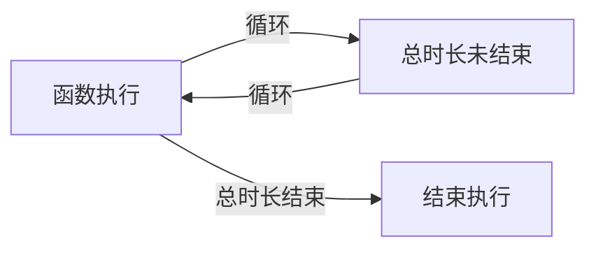
***
# 上手示例
## 用例
下面我们来通过操作 “百度搜索”，来对框架进行实例使用演示。
### 第一步： 工作目录创建
你可以在你电脑上的任意一个没有“权限限制”的位置新建一个文件夹，用它来作为你的工作目录。
例子中则直接在桌面新建，如下图所示：
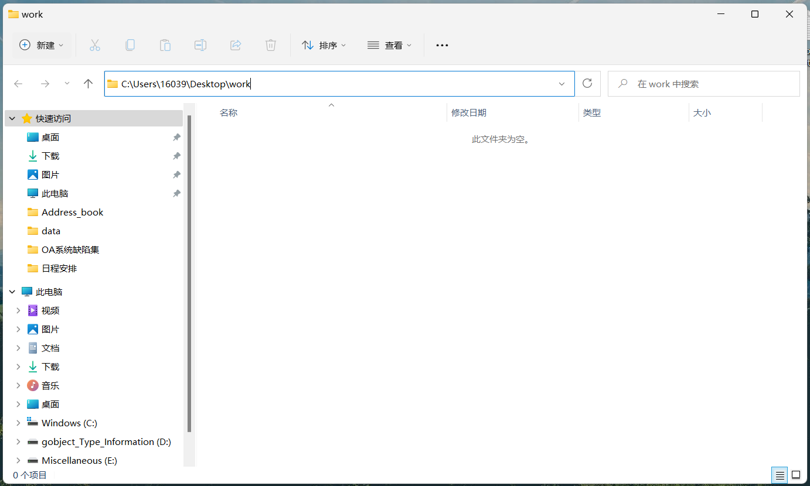
此时目录中没有任何文件，我们按照 “必要准备”中的说明，将一些必要的文件完成创建，例子中采用框架命令的方式来创建。
在工作目录(文件夹)中打开终端，键入`kdtest --new` 和 `kdtest --parameter` 命令将框架的“用例数据包”和“参数配置文件”创建。
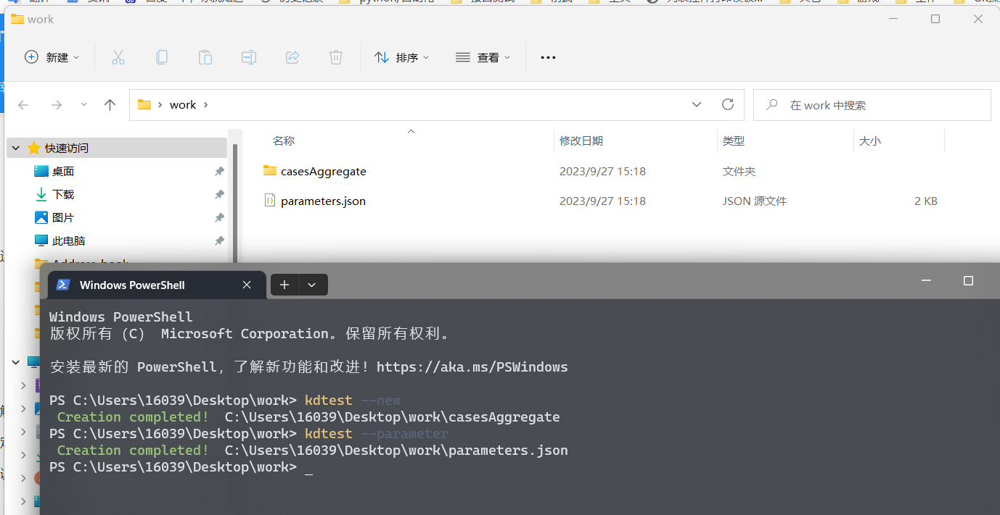
接下来将一些实例中不需要的内容和文件、文件夹从工作目录中删除
用例数据包只需要保留`testCases.xlsx`文件即可，`parameters.json`文件的修改则如下所示：
```json
{
    "testCaseFile": [
        {
            "caseFilePath": "",
        }
    ],
    "testEnvironment": {"browser": "Chrome","url": "http://localhost","implicitlyWait": 10},
    "auxiliaryFunction": {"retrySwitch": false}
}
```
> 注意：此时的`testCases.xlsx`文件中存在有多个sheet表，我们只需要保留一个即可，多余的可以删除。

### 第二步：参数配置
* 将用例文件的路径书写到`parameters.json`文件的`testCaseFile - caseFilePath`中:（路径从工作目录中的数据包开始书写即可，目录分隔符需要用`\\`表示）
* 将测试环境配置好，示例中我们采用Chrome浏览器，测试地址为：`https://www.baidu.com/`，隐式等待时间设置为5s
	```json
	{
	    "testCaseFile": [
	        {
	            "caseFilePath": "casesAggregate\\testCases.xlsx",
	        }
	    ],
	    "testEnvironment": {"browser": "Chrome","url": "https://www.baidu.com/","implicitlyWait": 5},
	    "auxiliaryFunction": {"retrySwitch": false}
	}
	```
### 第三步：书写测试用例
测试的流程主要设置为：
| 步骤 | 概述 
| :-: | :-: 
| 第一步 | 在搜索框中输入“自动化测试” 
| 第二步 | 点击“百度一下”按钮
| 第三步 | 强制等待1s等待检索结果加载
| 第四步 |  对检索结果进行断言，判断第一条结果的文字中是否包含“自动化”三个字
| 第五步 |  测试结束

按照测试流程中的步骤，这里简单解释一下各步骤会用到的关键字
* 输入关键字 `input_text`
* 点击关键字 `click_btn`
* 强制时间等待关键字 `time_sleep`
* 元素文本值断言关键字 `selfText_assert`

首先我们先将测试流程中涉及到的“元素”的定位数据书写好，由于框架的定位逻辑本身就继承自selenium框架这里就不再赘述，最后的定位数据如下：
| 元素 | 定位方式 | 定位表达式  | 索引
| :-: | :-: | :-:  | :-: 
| 搜索框 | id | kw | 
| “百度一下”按钮 | id | su | 
| 第一条检索结果 | xpaths | //h3/a | 0

接下来我们把上面提到的 “关键字” 和 “元素节点数据”进行一一对应，并按照流程书写到用例文件中，首先先采用“不区分元素节点数据”的用例书写形式：
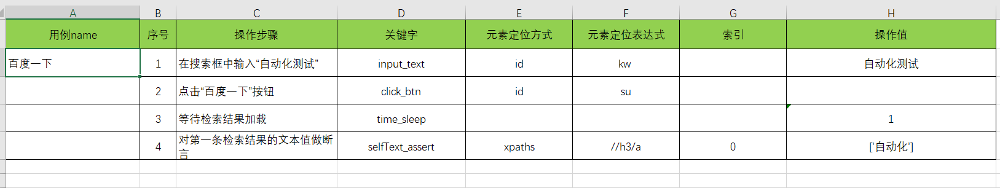
> 在 `selfText_assert` 关键字中若断言文本用`[]`包裹，则代表对该值做包含值比较

> 另外在用例中，若关键字没有对应的值，或者不需要传入则对应的单元格为空即可

若是采用“区分元素节点数据”的用例书写形式，则需要将元素节点数据书写到“与用例文件目录同级的以`element_`开头的文件夹中的`elementData.yaml`文件中”，这样框架才能够找到这些数据。
* 首先我们要在数据包下创建一个以`element_`开头的文件夹，用来存放元素节点数据。例子中我们将其命名为`element_data`。
* 由于我们的用例文件`testCases.xlsx`是直接就存放在数据包文件夹下，所以我们就直接在`element_data`文件夹下创建一个名为`elementData.yaml`的文件即可。
* 创建好后，将上面提到的“元素节点数据”书写到文件中，如下所示：
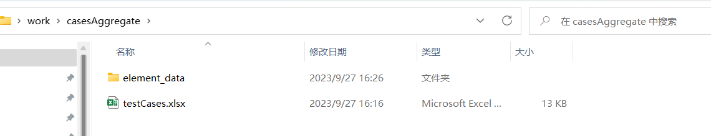
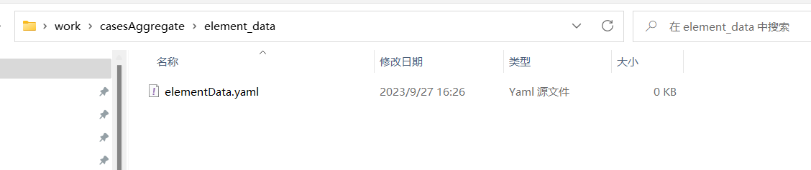
	```yaml
	# elementData.yaml
	baidu:  # 自定义名称
	  SS_input:  # 自定义名称
	    - id
	    - kw 
	  AN_button:
	    - id
	    - su
	  JG_text:
	    - xpaths
	    - //h3/a
	    - 0
	```
* 最后将文件中定义好的元素节点数据书写在用例中
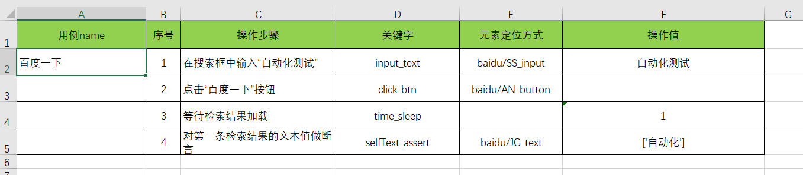
> 调用时采用在`elementData.yaml`文件中自定义的“名称”，名称和名称之间需要用`/`符号进行分隔

### 第四步：运行和测试结果
* 用例书写完毕后，直接在工作目录(文件夹)中打开终端，键入`kdtest`命令即可完成用例的执行。注意此处需要你确保你的电脑中存在`parameter.json`文件中指定的浏览器对应的驱动，否则无法运行。
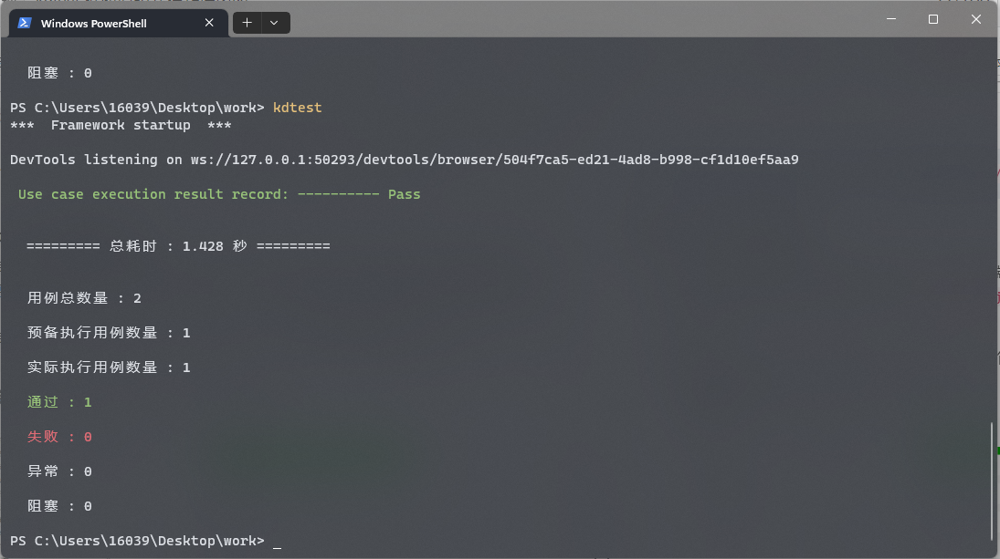

* 用例执行完毕后，会在工作目录的`result - report` 文件夹中生成一个html类型的测试报告，如下：
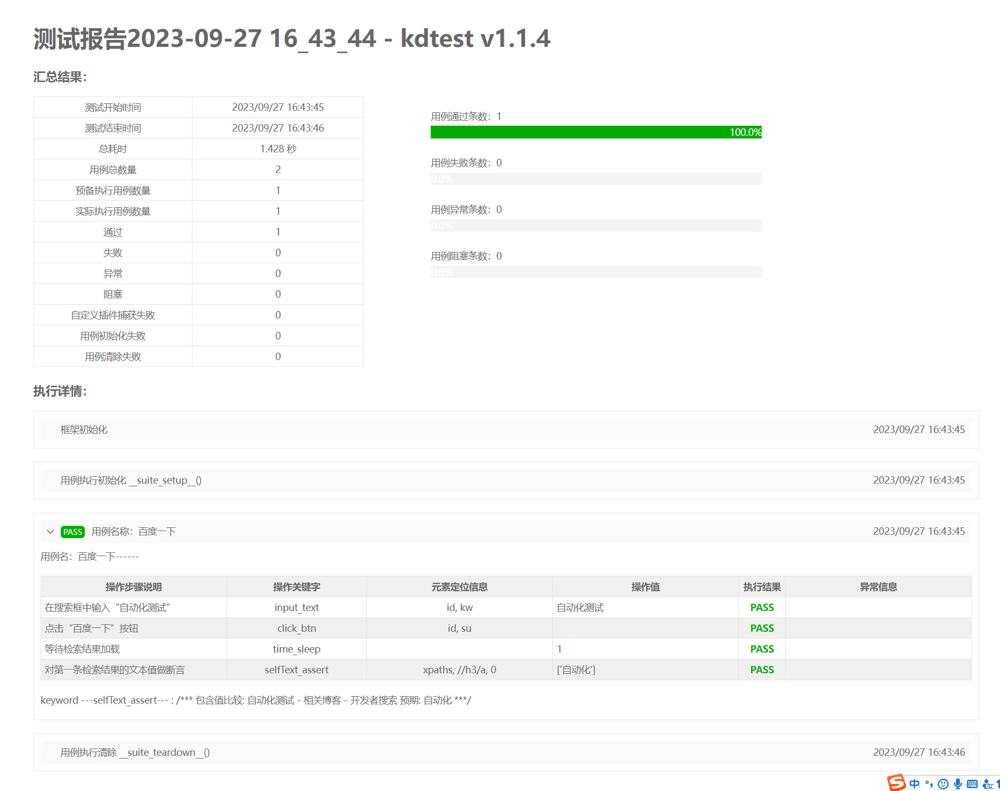
> `result` 文件夹为自动生成，不需要手动创建。
## 接口
下面我们通过一个实例系统中的功能接口，来对框架中的接口数据文件进行书写示例。
> 实例系统的本机地址：`http://127.0.0.1:5000/index/`, 也是功能接口的基础地址
### 第一步：接口信息
所谓的接口信息就是我们要事先清楚被测接口的地址、请求方式、请求参数、响应结果格式等，以便我们对其进行请求测试，本次实例中使用到的接口信息如下：
| 名称 | 值 
| :-: | :- 
| 请求地址 |  `resultsHistory/query`
| 请求方式 | `POST`
| 请求头| `Content-Type: multipart/form-data`
| 请求参数 | `screeningIden 被筛查人标识`
| 响应结果格式 |  ```{'status': '1', 'mag': '查询成功', 'history': [...]}```

| 名称 | 值 
| :-: | :- 
| 请求地址 |  `resultsHistory/query`
| 请求方式 | `GET`
| 请求参数 | `screeningIden 被筛查人标识`
| 响应结果格式 |  ```{'status': '1', 'mag': '查询成功', 'history': [...]}```

> 注意：上方表格中的信息属于同一个接口，该接口可以通过 `GET` 和 `POST` 两种方法进行请求
### 第二步：编写接口数据文件
根据框架中的《接口数据文件书写规则》我们首先要将第一步中提供的接口信息转换成框架可读取识别的数据文件。
* 首先在任意位置新建一个以`InterfaceData`命名的yaml文件，并将其打开。
* 紧接着将第一步中提供的接口信息书写到文件中，采用`POST`请求方式书写如下：
	```yaml
	# interfaceData
	test_Interface:  # 任意命名，接口名称
	  _RA:
	    method: POST  # 请求方式
	    url: resultsHistory/query  # 请求地址
	    header:  # 请求头
	      Content-Type: multipart/form-data
	    data:  # POST请求参数
	      screeningIden: '王小明'
	  _RE:  # 响应结果断言
	    status: 1
	    mag: "查询成功"
	  _RS: None  # 接口请求状态，为None即可
	```
* 紧接着将第一步中提供的接口信息书写到文件中，采用`GET`请求方式书写如下：
	```yaml
	# interfaceData
	test_Interface:  # 任意命名，接口名称
	  _RA:
	    method: GET  # 请求方式
	    url: resultsHistory/query  # 请求地址
	    para:  # GET请求参数
	      screeningIden: '060123180198'
	  _RE:  # 响应结果断言
	    status: 1
	    mag: "查询成功"
	  _RS: None  # 接口请求状态，为None即可
	```
	> 有关上方书写示例中，各参数项的详细解释，可在文档 <a style="font-size:14px;">**数据文件 - 接口数据文件书写示例 - InterfaceData.yaml**</a> 中查看

	> 需要注意，在框架执行接口数据时，会将“参数配置文件`parameters.json`”中的被测系统地址与请求地址进行拼接后在执行，因此在书写接口地址时，基础地址也就是`http://127.0.0.1:5000/index/`不需要书写在文件中
### 第三步：接口数据文件存放
* 框架中规定“接口数据文件是作为辅助测试用例执行的一种文件”，所以它的存放位置需要参考测试用例文件的存放位置。
* 在实例中我们将与“接口数据文件” 对应的 “用例文件”直接存放在数据包文件夹下。所以我们就直接在数据包文件夹下创建一个以`interface_`开头的文件夹，并将刚刚书写好的文件存放入其中即可。
* 实例中我们以`interface_data`为该文件夹命名，如下所示：
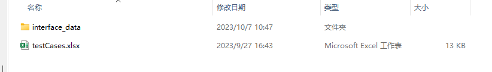
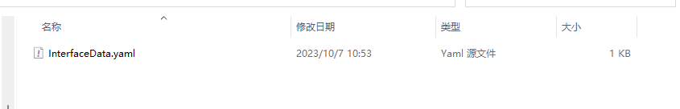
### 第四步：接口数据执行
在框架中支持以两种方式对书写好的接口数据进行执行，你可以在测试用例执行之前执行与之对应的接口数据，也可以在用例文件中通过指定的关键字运行接口数据。
* **在测试用例执行之前执行与之对应的接口数据：**(需要事先完成以下两个条件)
	* 1、文件存放的位置要与对应的测试用例文件对应，即“在用例数据包中存放文件时，需要原样复刻“用例文件”的目录结构”。(在本节 “第三步：接口数据文件存放” 中有示例)。
	* 2、在参数配置文件`parameters.json` 中，将用例的 “接口执行开关`interfaceSwitch`” 设置为`true`。
		```yaml
		# parameters.json
		{
		    "testCaseFile": [
		        {
		            "caseFilePath": "casesAggregate\\testCases.xlsx",
		            "interfaceSwitch": true  # 接口数据执行开关打开
		        }
		    ],
		    "testEnvironment": {"browser": "Chrome","url": "http://127.0.0.1:5000/index/","implicitlyWait": 10},
		    "auxiliaryFunction": {"retrySwitch": false}
		}
		```
	* 之后通过在控制台键入`kdtest` 命令让框架运行测试用例，对应的接口数据就会在测试用例执行之前被框架执行。
	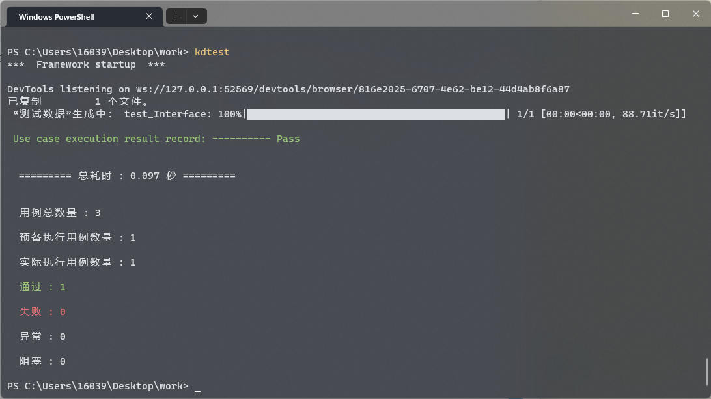
* **在用例文件中通过指定的关键字运行接口数据：**
	* 不考虑用例数据文件的存放位置。
	* 不需要对参数配置文件`parameters.json` 做修改。
	* 在用例中，将要执行的接口数据文件的路径传递给 `Interface_Invoke` 关键字，由该关键字完成接口数据的执行。
		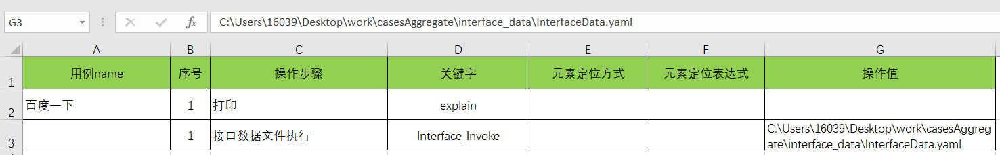
	* 通过在控制台键入`kdtest` 命令让框架运行测试用例，对应的接口数据会随着关键字的调用而执行
		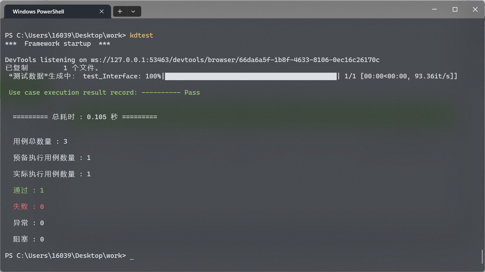
	* 框架执行结果报告
		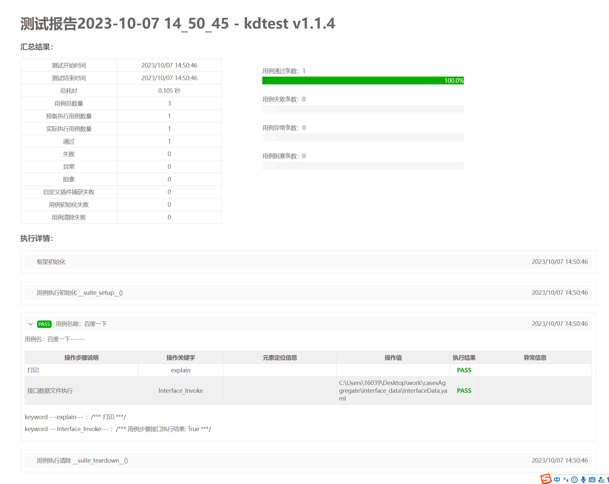
> 可在文档 <a style="font-size:14px;">**关键字 - 框架原生关键字方法(page_Action) - 特殊功能 - Interface_Invoke()关键字**</a> 中查看`Interface_Invoke` 关键字的详细使用说明